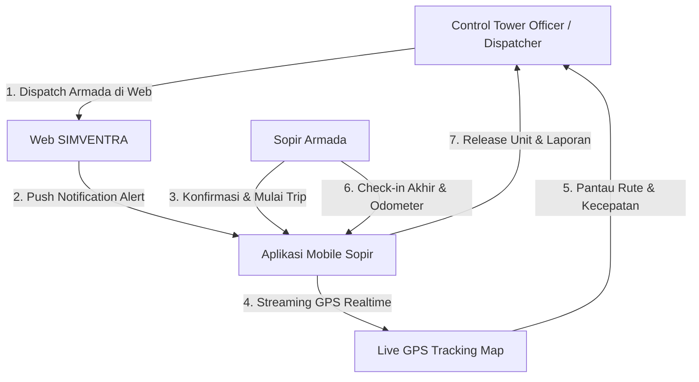
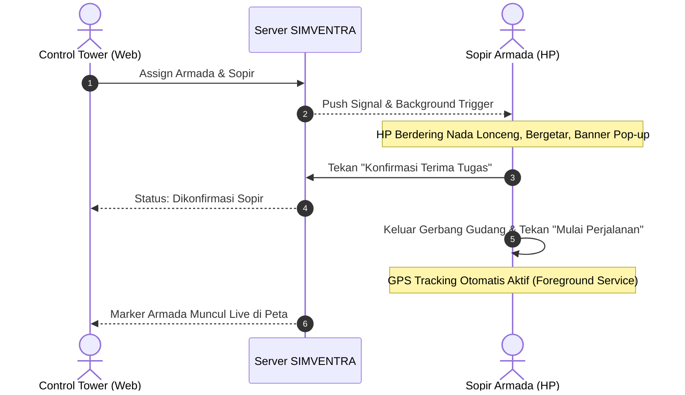

# STANDAR OPERASIONAL PROSEDUR (SOP)
## PUSAT KENDALI OPERASIONAL ARMADA (CONTROL TOWER)
### SISTEM INFORMASI MANAJEMEN VENTILASI & ARMADA (SIMVENTRA)
**PT RAJAWALI HANDAL LOGISTIK (RHL)**

---

| Nomor Dokumen | Revisi | Tanggal Efektif | Departemen | Klasifikasi |
| :--- | :---: | :---: | :---: | :---: |
| **SOP-RHL-OPS-001** | **2.0** | **17 September 2026** | **Operasional & Logistik** | **Internal Dokumen** |

---

## 1. TUJUAN & RUANG LINGKUP

### 1.1 Tujuan
1. Menjamin keselamatan berkendara, ketepatan waktu pengiriman barang (*On-Time Delivery*), dan keandalan armada logistik secara terpusat.
2. Memastikan seluruh penugasan unit kendaraan termonitor secara *real-time* dari Control Tower melalui koordinat GPS, status kecepatan, dan pencatatan odometer.
3. Menstandarisasi interaksi kerja harian antara **Dispatcher/Control Tower Officer** pada Web Dashboard dan **Sopir Armada** pada Aplikasi Mobile SIMVENTRA Driver.

### 1.2 Ruang Lingkup
Prosedur ini berlaku untuk seluruh armada logistik (Blindvan, Box, Truk), staf operasional Control Tower, kepala gudang, serta seluruh pengemudi/sopir di lingkungan PT Rajawali Handal Logistik.

---

## 2. PERAN & TANGGUNG JAWAB (RACI MATRIX)

* **Control Tower Officer (Dispatcher)**: Bertanggung jawab atas verifikasi dokumen kendaraan/sopir, penugasan armada, pengawasan GPS pergerakan unit secara langsung, dan verifikasi check-in kepulangan unit.
* **Sopir Armada (Driver)**: Bertanggung jawab mengaktifkan mode siaga di aplikasi HP, mengonfirmasi penugasan, mematuhi batas kecepatan jalan, dan melaporkan odometer fisik saat kembali ke gudang.
* **Petugas Gudang (Checker / Pool Officer)**: Memeriksa kondisi fisik unit saat keberangkatan dan kepulangan (kebersihan, muatan halal/non-halal, kerusakan fisik).
* **Fleet / Maintenance Officer**: Menindaklanjuti unit dengan status *maintenance* atau kebutuhan servis/cuci berdasarkan laporan akhir sopir.

---

## 3. ALUR OPERASIONAL HARIAN (STEP-BY-STEP SOP)

---

### SOP-01: PERSIAPAN & MODE SIAGA SOPIR (PRE-TRIP STANDBY)

#### A. Prosedur Sopir di Aplikasi Mobile (`simventra-driver.apk`):
1. **Presensi & Login Aplikasi**:
   * Sopir membuka aplikasi **SIMVENTRA Driver** di HP Android masing-masing.
   * Masukkan Email/Nomor HP dan Kata Sandi yang telah terdaftar (contoh: `agus@gmail.com`).
   * Pastikan nama sopir dan inisial (misal: **AG - Agus Dwiyantoro**) tampil dengan benar di header atas aplikasi.
2. **Mengaktifkan Mode Siaga (Standby di Pool)**:
   * Saat sopir standby di area pool/gudang, biarkan aplikasi aktif.
   * Pastikan notifikasi persisten di status bar atas HP muncul:  
     🟢 **"SIMVENTRA Driver Siaga — Standby di Pool — Siap menerima tugas"**.
   * Sopir diperbolehkan meminimalkan aplikasi atau mengunci layar HP; sistem *background service* tetap siaga memantau tugas.

#### B. Prosedur Control Tower di Web Dashboard:
1. **Pemeriksaan Kelayakan Unit & Dokumen**:
   * Buka menu **Armada > Kendaraan**.
   * Pastikan status unit **Active** (bukan *Maintenance* atau *Sedang Bertugas*).
   * Periksa banner peringatan dokumen: pastikan masa berlaku STNK, KIR, dan Asuransi tidak berstatus kadaluwarsa (*Expired*).
2. **Penugasan Armada (Dispatching)**:
   * Klik tombol **Detail / Aksi** pada unit yang akan diberangkatkan (misal: `B 3942 LMI`).
   * Klik tombol **"Tugaskan Sopir & Armada"**.
   * Isi formulir penugasan:
     * **Pilih Sopir**: Pilih nama sopir yang berstatus *Active* dan memiliki lisensi SIM valid.
     * **Tujuan Pengiriman**: Masukkan alamat/destinasi rute (contoh: `Cawang / Cengkareng`).
     * **Odometer Awal**: Masukkan angka odometer terkini dari fisik dashboard speedometer.
     * **Catatan Tambahan**: Masukkan instruksi muatan khusus (misal: *Wajib Segel Halal, Barang Fragile*).
   * Klik **"Simpan & Berangkatkan Armada"**.

---

### SOP-02: PENERIMAAN TUGAS & KEBERANGKATAN (DISPATCH & DEPARTURE)

1. **Penerimaan Notifikasi**:
   * Begitu penugasan dibuat di web, HP sopir akan otomatis **membunyikan nada dering lonceng alert (chime)**, bergetar panjang, dan memunculkan pop-up banner:  
     🔔 **"Tugas Armada Baru Diterima! Armada B 3942 LMI ditugaskan ke Anda. Tujuan: Cawang."**
2. **Konfirmasi Penerimaan**:
   * Sopir membuka notifikasi / aplikasi, memeriksa detail kendaraan dan tujuan.
   * Sopir menekan tombol hijau: **"✓ Konfirmasi Terima Tugas"**.
   * Status di layar Control Tower otomatis berubah menjadi *Dikonfirmasi Sopir*.
3. **Mulai Perjalanan (Keluar Gerbang Pool)**:
   * Setelah unit selesai dimuat dan surat jalan diterima, saat kendaraan melintasi gerbang keluar gudang, sopir menekan tombol biru:  
     🚀 **"Mulai Perjalanan (Keluar Gudang)"**.
   * Notifikasi di HP berubah menjadi:  
     🔵 **"SIMVENTRA Driver Aktif — Melacak rute armada secara real-time"**.
   * Sistem GPS background otomatis aktif dan streaming koordinat setiap 3–4 detik ke server.

---

### SOP-03: MONITORING PERJALANAN REAL-TIME (ON-TRIP CONTROL TOWER)

1. **Pengawasan Peta Monitoring**:
   * Petugas Control Tower membuka menu **Monitoring > Live GPS Armada** (`/monitoring-armada`).
   * Seluruh armada yang berstatus *On-Trip* tampil sebagai marker bergerak pada peta OpenStreetMap interaktif:
     * 🔵 **Marker Biru**: Armada reguler yang sedang berjalan.
     * 🟢 **Marker Hijau**: Armada khusus berlabel *Halal Dedicated*.
     * 🏢 **Marker Oranye**: Titik referensi Gudang Utama PT Rajawali Handal Logistik.
2. **Indikator Kecepatan & Telemetri**:
   * Mengklik armada pada daftar samping atau marker di peta akan membuka kartu rincian:
     * **Kecepatan Terkini (KM/H)**
     * **Arah Mata Angin (Heading) & Koordinat Latitude/Longitude**
     * **Waktu Update Terakhir (Latency sinyal GPS)**
3. **Aturan Batas Kecepatan & Keselamatan (Speed Limit Policy)**:
   * **Jalan Bebas Hambatan (Tol)**: Maksimal **80 KM/Jam**.
   * **Jalan Arteri / Perkotaan**: Maksimal **50 KM/Jam**.
   * Jika pada dashboard kecepatan armada melebihi 85 KM/Jam, dispatcher wajib menghubungi sopir via tombol telepon di dashboard untuk memberikan peringatan keselamatan.
4. **Penanganan Deviasi Rute atau Sinyal Hilang**:
   * Jika sinyal GPS tidak ter-update lebih dari 15 menit saat status *On-Trip*, Control Tower menghubungi sopir untuk memastikan:
     * Apakah baterai HP habis / koneksi data terputus.
     * Apakah unit mengalami kendala mogok / insiden kecelakaan.

---

### SOP-04: CHECK-IN KEPULANGAN & PELEPASAN UNIT (POST-TRIP RELEASE)

1. **Pelaporan oleh Sopir di Aplikasi HP**:
   * Saat kendaraan tiba kembali di pool/gudang logistik dan mesin dimatikan:
   * Sopir menekan tombol oranye: **"🏁 Selesai & Masuk Gudang (Check-in)"**.
   * Muncul modal formulir penyelesaian:
     * **Odometer Akhir (KM)**: Wajib diisi angka odometer fisik dashboard saat ini (tidak boleh lebih kecil dari KM awal keberangkatan).
     * **Kondisi Kendaraan**: Pilih salah satu opsi:
       * 🟢 **Baik / Prima**: Siap digunakan tugas berikutnya.
       * 🟡 **Perlu Cuci**: Eksterior/interior kotor setelah pengiriman.
       * 🟠 **Perlu Perawatan**: Ada indikasi ban aus, rem berdecit, atau oli mendekati jadwal servis.
       * 🔴 **Rusak / Kendala**: Mogok, lampu mati, atau kendala mekanis berat.
     * **Catatan Kepulangan**: Tulis keterangan pengiriman (misal: *Barang selesai bongkar di Cawang tanpa kendala*).
   * Sopir menekan **"Kirim Laporan Check-in"**.
   * Aplikasi otomatis mematikan GPS tracking background dan kembali ke **Mode Siaga**.

2. **Verifikasi & Rilis Unit oleh Control Tower (Web)**:
   * Control Tower menerima pembaruan di halaman detail kendaraan.
   * Jika sopir melaporkan kondisi *Perlu Cuci* atau *Perlu Perawatan / Rusak*, sistem secara otomatis mengubah status kendaraan menjadi **Maintenance**, mencegah unit ditugaskan ke trip lain sebelum selesai diperbaiki.
   * Data riwayat perjalanan, jarak tempuh (KM Akhir - KM Awal), dan durasi pengiriman otomatis diarsipkan pada tabel **Riwayat Penugasan & Perjalanan**.

---

## 4. SOP PENANGANAN DARURAT & TROUBLESHOOTING

| No | Kondisi / Masalah | Tindakan Sopir (Mobile) | Tindakan Control Tower (Web) |
| :---: | :--- | :--- | :--- |
| **1** | **Kendaraan Mogok / Insiden di Jalan** | Menyalakan lampu hazard, parkir di bahu jalan aman. Hubungi Dispatcher via telepon. | Hubungi tim derek/mekanik terdekat. Catat status di log aktivitas kendaraan. |
| **2** | **Sinyal GPS Hilang / Peta Blank** | Pastikan izin Lokasi diatur ke *"Allow all the time"*. Periksa paket data HP. | Cek status server di log aktivitas. Gunakan tombol kontak sopir di dashboard untuk tracking manual. |
| **3** | **HP Sopir Mati / Lowbat** | Hubungkan HP ke *car charger* armada. Jika mati total, laporkan KM akhir manual ke petugas gudang saat tiba. | Petugas Control Tower dapat melakukan *Manual Return Check-in* melalui tombol **"Check-In Kembali ke Gudang (Release)"** di web. |
| **4** | **Peringatan Dokumen Expired** | Sopir tidak diperkenankan mengemudi jika SIM telah kadaluwarsa. | Sistem menolak penugasan sopir/unit dengan dokumen expired hingga diperbarui di menu Dokumen. |

---

## 5. REKAPITULASI DOKUMEN & INTEGRASI SISTEM

* **Aplikasi Mobile Driver**: Terpasang di perangkat Android sopir (`simventra-driver.apk`).
* **Web Admin Control Tower**: Diakses oleh Dispatcher melalui browser di `https://simventra.hybridtechnologi.com/`.
* **Arsip Log Audit**: Seluruh aktivitas assign, konfirmasi, update lokasi, dan check-in dicatat secara permanen di menu **Administrasi > Log Aktivitas** untuk kebutuhan kepatuhan (*compliance*) dan audit ISO.

---
*Dokumen SOP ini sah dan berlaku efektif sejak tanggal ditetapkan oleh Manajemen Operasional PT Rajawali Handal Logistik.*
